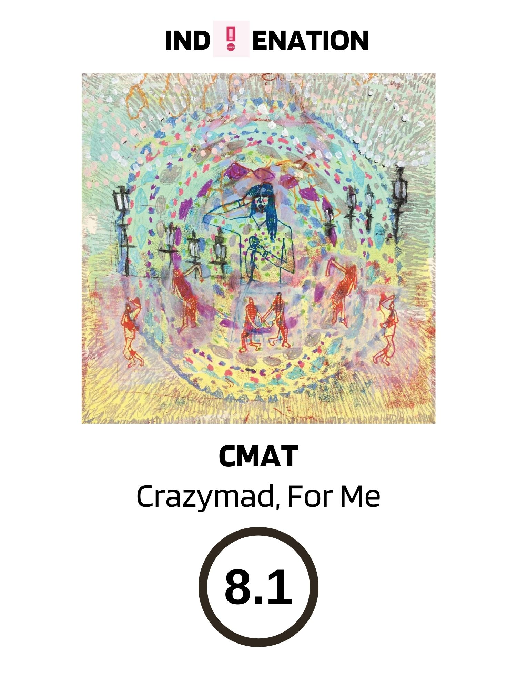

# 这位独立民谣界的新宠，有点霸道有点自恋

<figure markdown>
  { align=center width=420 }
</figure>

在爱尔兰以至于全球的音乐圈中，一位名叫CMAT（Ciara Mary-Alice Thompson）的独立民谣歌手正迅速获得听众们的关注。她以其独特的魅力和精彩的音乐创作圈了不少歌迷粉丝。她最新专辑《Crazymad, for Me》则显得更加霸气和自信，展示了她作为一个歌手的成长历程。

和一般独立歌手不同的是，CMAT的音乐能贴近听众的灵魂，也就是更“接地气”。她的演唱风格让我联想到了Regina Spektor。除此之外，CMAT的音乐也让我想起了Caroline Rose和Jade Bird这样的独立歌手。

《Crazymad, for Me》不仅仅是一张普通的民谣专辑，它还是一段情感上的深刻探讨。这张专辑深入剖析了“toxic relationship”所带来的心碎时刻，而且让听众感觉自己仿佛置身于故事之中。CMAT以她独有的黑色幽默，勾勒出一个有着小聪明、但仍然被有毒的男友气得怒火中烧的女性形象。

这张专辑的精髓还在于CMAT的内心独白，和“time travel”（时间旅行）的概念。她告诉我们，我们必须找到一种：和前任分手再见，并且找到新乐子的方式。这就是专辑结束曲《Have Fun!》所传达的意思，她抱怨着她在前任身上浪费了过多的的时间和金钱。“傻妞！”她唱着，“你本应该将钱都花在自己身上！”（You shoulda spent it on yourself!)

CMAT的《Crazymad, For Me》证明了爱尔兰乡村民谣音乐其实是完全可以胜过一些美国歌手的作品的。然而，与她自己在2022年发布的首张专辑《If My Wife Knew I'd Be Dead》相比，这张专辑在2023年的发布显得有些仓促，专辑的歌曲或许还缺乏一些整体感，但这不影响我们享受她的音乐。

她在采访中这样描述自己：“我有点霸道，也有点自恋。”这和她在音乐中告诉我们的一样，无需一个时光机，我们也能清楚地认识自己。她鼓励我们享受音乐、电影、美酒和生活，因为二十年后，我们依然是自己，不必为过去的一切而懊悔。 PS：她本人还是阿里巴巴的忠实使用者（图三）。

没错，CMAT或许有点霸道，也有点自恋，但正是这种自信和坚定让她的音乐如此引人入胜。