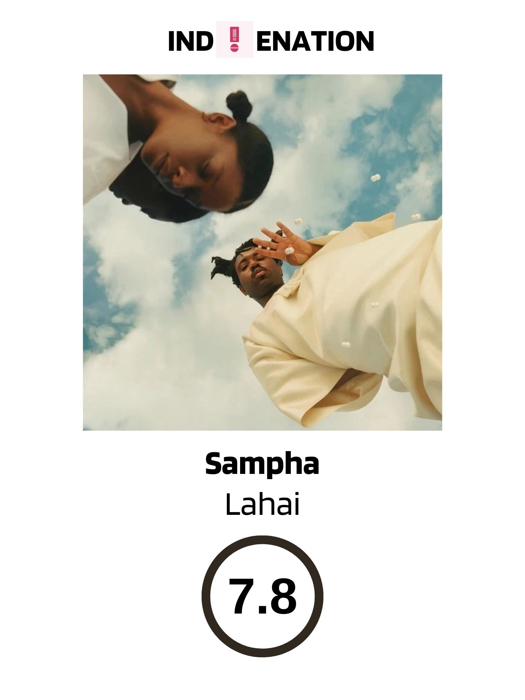

# 时间、神圣、无限和连接

<figure markdown>
  { align=center width=420 }
</figure>

英国创作歌手Sampha不仅在他自己的音乐生涯中取得了辉煌的成就，还以一些合作的作品而闻名：从Drake的“Too Much”到Solange的“Don't Touch My Hair”，还有Kendrick Lamar的“Father Time”。这位英国创作歌手将他的新专辑《Lahai》的主题描述为“时间、神圣、无限和连接”。

在这张新专辑中，他创作的旋律依旧美丽，他的嗓音依旧如此温暖，但他的歌声周围的一切似乎总是跳动的碎拍和动荡不安的钢琴伴奏。专辑开篇曲目《Stereo Colour Sound (Shaman's Dream)》以伦敦歌手Sheila Maurice-Grey清晰的独白开始。 "I Miss You" 渐渐过渡到 "Time Misuse"，然后一个碎裂感的鼓点应运而生，将Sampha的声音缓缓展开。

这张专辑从头到尾都充满了跳跃的能量，完美地诠释了关于爱与失落的主题，堪称是一种治疗性的聆听体验。它能立刻让你沉浸其中，仿佛置身于一个超凡脱俗的灵魂乐/R&B的音乐之旅。但也有一些负面评价，有人认为专辑其中的一些部分相当无聊，第一次听完时感觉有些单调。

Sampha似乎很喜欢阅读Richard Bach的《乔纳森·利文斯顿海鸥》（Jonathan Livingston Seagull），一部1970年代畅销的短篇小说，其中讲述了一只海鸥不断地在思考生命的意义和自由的含义，在专辑中这篇小说也被多次提及。这张专辑可能会让你有一些无聊的时刻，但也会有许多令人兴奋的时刻，并让你思考生命的意义。 Sampha的音乐可以带你走进一个神秘的音乐世界，让你在其中迷失，然后重新找到自己。